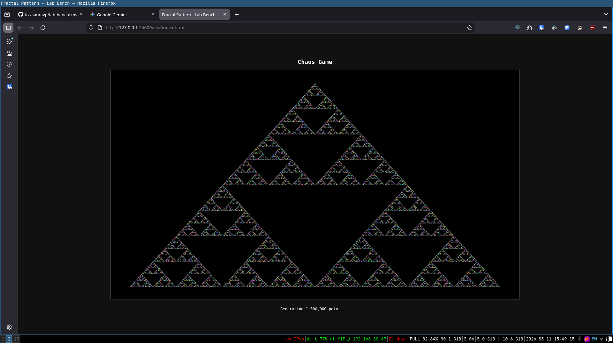
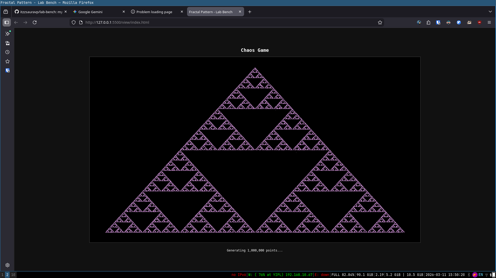

# Chaos Game & Sierpiński Triangle

This module explores the **Chaos Game**, a method of generating fractals using an initial polygon and a semi-random sequence of points. While the movement is determined by a random number generator, the resulting structure is a perfectly ordered **Sierpiński Triangle**.

## The Algorithm

1. **Define Vertices:** Three fixed points ($A, B, C$) forming a triangle.
2. **Seed Point:** Start at a random point $P$ within the triangle.
3. **Iteration:**
* Pick a random vertex from $\{A, B, C\}$.
* Calculate the midpoint between $P$ and the chosen vertex.
* Plot the midpoint and set it as the new $P$.
* Repeat $N$ times.

## Some Demos

  

  <em>Fig 1. Per-Pixel Randomization: Every pixel is assigned a unique random color at the moment of plotting. This visualization highlights the individual "steps" of the chaos game by giving each point its own distinct identity.</em>

  

  <em>Fig 2. Uniform Solid State: Every pixel is rendered using a single, consistent color. This removes visual noise to focus entirely on the emerging geometric structure and density of the fractal.</em>

